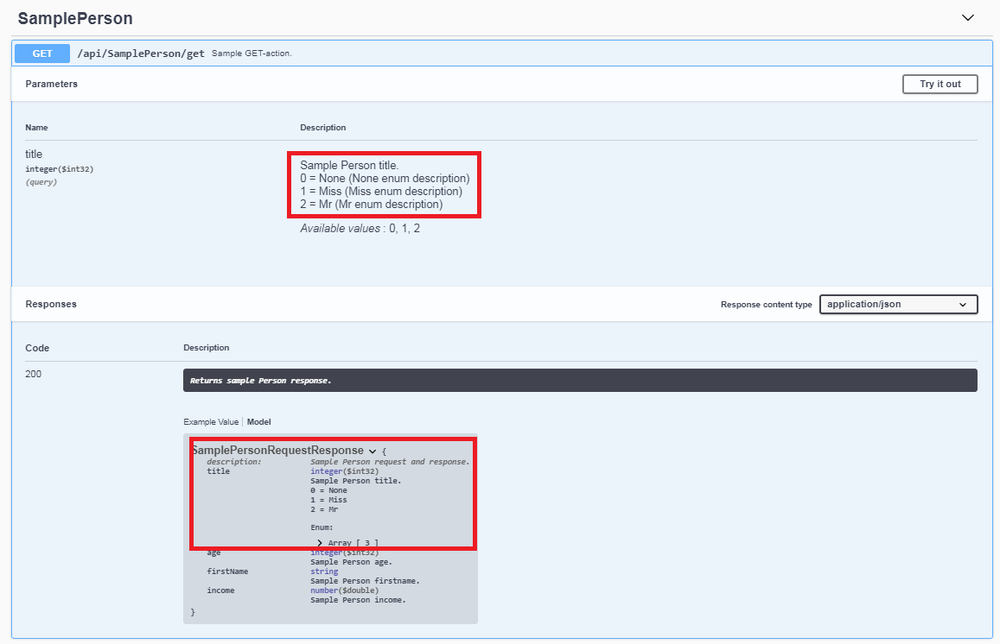
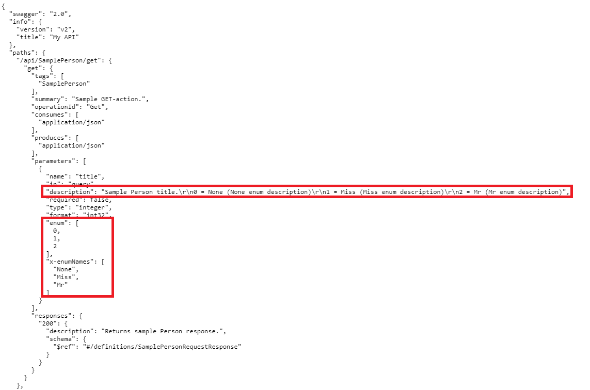

#


[Unchase Swashbuckle Asp.Net Core Extensions](https://www.nuget.org/packages/Unchase.Swashbuckle.AspNetCore.Extensions/) is a library contains a bunch of extensions (filters) for [Swashbuckle.AspNetCore](https://github.com/domaindrivendev/Swashbuckle.AspNetCore).

> The project is developed and maintained by [Nikolay Chebotov (**Unchase**)](https://github.com/unchase).

## Getting Started

To use the extensions: 
1. First install the [NuGet package](https://www.nuget.org/packages/Unchase.Swashbuckle.AspNetCore.Extensions/):

```powershell
Install-Package Unchase.Swashbuckle.AspNetCore.Extensions
```

2. Then use whichever extensions (filters) you need

## Extensions (Filters) use

1. **Fix enums**: 
- In the _ConfigureServices_ method of _Startup.cs_, inside your `AddSwaggerGen` call, enable whichever extensions (filters) you need:

```csharp
// This method gets called by the runtime. Use this method to add services to the container.
public void ConfigureServices(IServiceCollection services)
{
    // Add framework services.
    services.AddMvc();

    services.AddSwaggerGen(options =>
    {
        options.SwaggerDoc("v1", new Info { Title = "My API", Version = "v1" });

        // Add filters to fix enums
        options.AddEnumsWithValuesFixFilters(true);
        // or custom use:
        //options.SchemaFilter<XEnumNamesSchemaFilter>(); // add schema filter to fix enums (add 'x-enumNames' for NSwag) in schema
        //options.ParameterFilter<XEnumNamesParameterFilter>(); // add parameter filter to fix enums (add 'x-enumNames' for NSwag) in schema parameters
        //options.DocumentFilter<DisplayEnumsWithValuesDocumentFilter>(true); // add document filter to fix enums displaying in swagger document

        // Include xml-comments from xml-file generated by project
        var filePath = Path.Combine(AppContext.BaseDirectory, "WebApi2.0-Swashbuckle.xml");
        options.IncludeXmlComments(filePath);
    });
}
```

2. **Hide SwaggerDocumentation PathItems** without accepted roles: 
- In the _ConfigureServices_ method of _Startup.cs_, inside your `AddSwaggerGen` call, enable whichever extensions (filters) you need:

```csharp
// This method gets called by the runtime. Use this method to add services to the container.
public void ConfigureServices(IServiceCollection services)
{
    ...

    services.AddSwaggerGen(options =>
    {
        ...

        // add Security information to each operation for OAuth2
        options.OperationFilter<SecurityRequirementsOperationFilter>();

        // optional: if you're using the SecurityRequirementsOperationFilter, you also need to tell Swashbuckle you're using OAuth2
        options.AddSecurityDefinition("oauth2", new ApiKeyScheme
        {
            Description = "Standard Authorization header using the Bearer scheme. Example: \"bearer {token}\"",
            In = "header",
            Name = "Authorization",
            Type = "apiKey"
        });
    });
}
```

- In the _Configure_ method of _Startup.cs_, inside your `UseSwagger` call, enable whichever extensions (filters) you need:

```csharp
// This method gets called by the runtime. Use this method to configure the HTTP request pipeline.
public void Configure(IApplicationBuilder app, IHostingEnvironment env)
{
    ...

    app.UseSwagger(c =>
    {
        c.PreSerializeFilters.Add((swaggerDoc, httpRequest) =>
        {
            // hide all SwaggerDocument PathItems with added Security information for OAuth2 without accepted roles (for example, "AcceptedRole")
            swaggerDoc.HidePathItemsWithoutAcceptedRoles(new List<string> {"AcceptedRole"});
        });
    });

    ...
}
```

3. **Append action count into the SwaggetTag's descriptions**:
- In the _ConfigureServices_ method of _Startup.cs_, inside your `AddSwaggerGen` call, enable whichever extensions (filters) you need:

```csharp
// This method gets called by the runtime. Use this method to add services to the container.
public void ConfigureServices(IServiceCollection services)
{
    ...

    services.AddSwaggerGen(options =>
    {
        ...

        // enable swagger Annotations
        options.EnableAnnotations();

        // add action count into the SwaggerTag's descriptions
        options.DocumentFilter<AppendActionCountToTagSummaryDocumentFilter>();

        ...
    });
}
```

## Builds status

|Status|Value|
|:----|:---:|
|Build|[](https://ci.appveyor.com/project/unchase/unchase-swashbuckle-aspnetcore-extensions)
|Tests|[](https://ci.appveyor.com/project/unchase/unchase-swashbuckle-aspnetcore-extensions/build/tests)
|Buid History|
|GitHub Release|[](https://github.com/unchase/unchase.swashbuckle.aspnetcore.extensions/releases/latest)
|GitHub Release Date|[](https://github.com/unchase/unchase.swashbuckle.aspnetcore.extensions/releases/latest)
|GitHub Release Downloads|[](https://github.com/unchase/unchase.swashbuckle.aspnetcore.extensions/releases/latest)
|Nuget Version|[](https://www.nuget.org/packages/Unchase.Swashbuckle.AspNetCore.Extensions/) 
|Nuget Downloads|[](https://www.nuget.org/packages/Unchase.Swashbuckle.AspNetCore.Extensions/)

## Features

#### Fix enums

- Add an output enums integer values with there strings like `0 = FirstEnumValue` without a `StringEnumConverter` in swaggerUI and schema (by default enums will output only their integer values)
- Add description to each enum value that has an `[Description]` attribute in `swaggerUI` and schema - should use *options.DocumentFilter\<DisplayEnumsWithValuesDocumentFilter\>(**true**);* or *options.AddEnumsWithValuesFixFilters(**true**);*

    In [`Swashbuckle SwaggerUI`](https://github.com/domaindrivendev/Swashbuckle):

    

    In schema `parameters`:

    

    In schema `definitions`:

    

    To show enum values descriptions you should use `[Description]` attribute in your code:

    ```csharp
    /// <summary>
    /// Title enum.
    /// </summary>
    [DataContract]
    public enum Title
    {
        /// <summary>
        /// None.
        /// </summary>
        [Description("None enum description")]
        [EnumMember]
        None = 0,

        /// <summary>
        /// Miss.
        /// </summary>
        [Description("Miss enum description")]
        [EnumMember]
        Miss,

        /// <summary>
        /// Mr.
        /// </summary>
        [Description("Mr enum description")]
        [EnumMember]
        Mr
    }

    ...

    /// <summary>
    /// Sample Person request and response.
    /// </summary>
    public class SamplePersonRequestResponse
    {
        /// <summary>
        /// Sample Person title.
        /// </summary>
        public Title Title { get; set; }

        /// <summary>
        /// Sample Person age.
        /// </summary>
        public int Age { get; set; }

        /// <summary>
        /// Sample Person firstname.
        /// </summary>
        [Description("The first name of the person")]
        public string FirstName { get; set; }

        /// <summary>
        /// Sample Person income.
        /// </summary>
        public decimal? Income { get; set; }
    }
    ```
 - Fix enum values in generated by [`NSwagStudio`](https://github.com/RicoSuter/NSwag/wiki/NSwagStudio) or [Unchase OpenAPI Connected Service](https://marketplace.visualstudio.com/items?itemName=Unchase.unchaseopenapiconnectedservice) client classes:

    ```csharp
    /// <summary>Sample Person title.
    /// 0 = None (None enum description)
    /// 1 = Miss (Miss enum description)
    /// 2 = Mr (Mr enum description)</summary>
    [System.CodeDom.Compiler.GeneratedCode("NJsonSchema", "9.13.35.0 (Newtonsoft.Json v11.0.0.0)")]
    public enum Title
    {
        None = 0,
    
        Miss = 1,
    
        Mr = 2,
    
    }
    ```

#### Hide PathItems

- Hide all SwaggerDocument PathItems with added Security information for OAuth2 (with [Swashbuckle.AspNetCore.Filters](https://github.com/mattfrear/Swashbuckle.AspNetCore.Filters)) without accepted roles:

    

    You should use `AuthorizeAttribute` for methods or controllers:

    ```csharp
    ...
    public class SamplePersonController : ControllerBase
    {
        // this method will not be hidden with using 'swaggerDoc.HidePathItemsWithoutAcceptedRoles(new List<string> {"AcceptedRole"});'
        [Authorize(Roles = "AcceptedRole")]
        [HttpGet]
        public ActionResult<SamplePersonRequestResponse> Get(Title title)
        {
            ...
        }

        // this method will be hidden with using 'swaggerDoc.HidePathItemsWithoutAcceptedRoles(new List<string> {"AcceptedRole"});'
        [Authorize(Roles = "NotAcceptedRole")]
        [HttpPost]
        public ActionResult<SamplePersonRequestResponse> Post([FromBody] SamplePersonRequestResponse request)
        {
            ...
        }
    }
    ```

### Append action count into the SwaggetTag's descriptions


You should use `SwaggerTagAttribute` for controllers:

```csharp
[SwaggerTag("SamplePerson description")]
public class SamplePersonController : ControllerBase
{
    ...
}
```

## HowTos

- [ ] Add HowTos in a future
- [ ] ... [request for HowTo you need](https://github.com/unchase/Unchase.Swashbuckle.AspNetCore.Extensions/issues/new?title=DOC)

## Roadmap

See the [changelog](CHANGELOG.md) for the further development plans and version history.

## Feedback

Please feel free to add your [request a feature](https://github.com/unchase/Unchase.Swashbuckle.AspNetCore.Extensions/issues/new?title=FEATURE) or [report a bug](https://github.com/unchase/Unchase.Swashbuckle.AspNetCore.Extensions/issues/new?title=BUG). Thank you in advance!

## Thank me!

If you like what I am doing and you would like to thank me, please consider:

[](https://www.buymeacoffee.com/nikolaychebotov)

Thank you for your support!

----------

Copyright &copy; 2019 [Nikolay Chebotov (**Unchase**)](https://github.com/unchase) - Provided under the [Apache License 2.0](LICENSE).

